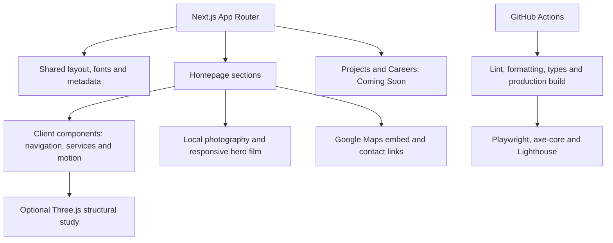

# DKS Builders

| Project credit                       | Contributor                                                        |
| :----------------------------------- | :----------------------------------------------------------------- |
| Client project & development company | **[Quentagon](https://quentagon.com/)**                            |
| Initial foundation & technical setup | **[Rizad Mohamed](https://www.linkedin.com/in/rizad-mohamed/)**    |
| Contributions                        | **[Hirusha Nilupul](https://www.linkedin.com/in/hirushanilupul/)** |

A responsive construction and civil engineering website for **DKS Builders, Sri Lanka**, built with Next.js, React and TypeScript.

[](https://github.com/rizad-mohamed/dksbuilders/actions/workflows/ci.yml)

**[Local preview](http://localhost:3000)** · **[Verification results](docs/validation.md)** · **[Asset provenance](docs/content-and-assets.md)**

Source is maintained in **[rizad-mohamed/dksbuilders](https://github.com/rizad-mohamed/dksbuilders)**. The badge links to the Quality workflow, which validates pushes and pull requests. Publishing source does not deploy the website; hosting remains a separate step.


## Current Project Status

Status as of **6 October 2026**. Package version: **2.0.0**.

| Area               | Current status                                                                                                                             |
| :----------------- | :----------------------------------------------------------------------------------------------------------------------------------------- |
| Homepage           | Implemented, including company, services, project photography, careers invitation, approach, contact and office map.                       |
| Projects & Careers | Separate routes with intentional **Coming Soon** pages.                                                                                    |
| Visual identity    | DKS blue, navy and engineering yellow; sharper corners, square glass navigation and asymmetric layouts.                                    |
| Services           | Six selectable disciplines with matching engineering icons, prominent titles, image previews and email enquiries.                          |
| Interaction        | Scroll progress, connected process flow, career image reveal, restrained parallax and brief heading decoding.                              |
| Local verification | Production build, lint, formatting and strict TypeScript passed; all **28 browser UAT tests** passed against the current production build. |
| Latest icon update | TypeScript, component lint, keyboard selection, service accessibility and card fitting at 320, 375, 768 and 1440 px passed.                |
| Delivery           | Source publication to this repository is authorized. GitHub Actions validates each push; website deployment remains separate.              |

## Features

- Engineering drawing aesthetic with controlled corners, self-hosted typography and layouts that vary their visual weight across sections.
- Floating, square glass navigation with a solid-fill fallback, keyboard-accessible mobile menu and Escape support.
- Cinematic hero film with mobile media, autoplay, playback controls, poster fallback and persistent visitor pause behavior.
- Five supplied project photographs, a project register and eight trusted-brand logos in their original colours.
- Six construction disciplines with building, road, bridge, pipe, water-flow and house icons, plus clear active states.
- Scroll progress, a gradual career image reveal and an approach timeline that connects and highlights reached steps.
- Subtle hover feedback, selected-image parallax and one-time technical text decoding with stable accessible headings.
- Optional Three.js structural study with Plan, Frame and Enclosure stages and rotation controls.
- Exact Google Maps office pin, directions links, floating WhatsApp contact and centered **Developed by Quentagon** credit.
- Reduced-motion support, data-saving behavior for heavy enhancements and video pausing offscreen or in hidden tabs.

## Tech Stack

[](https://skillicons.dev)

| Layer         | Technology                                                                           |
| :------------ | :----------------------------------------------------------------------------------- |
| Framework     | **Next.js 16.3.8**, App Router and server-rendered routes.                           |
| UI & language | **React 19.3**, **TypeScript 6**, semantic HTML and native CSS.                      |
| Motion        | **Motion 14**, IntersectionObserver, requestAnimationFrame and CSS scroll timelines. |
| Icons & 3D    | **Phosphor Icons 2.1**, **Three.js 0.186**.                                          |
| Typography    | Self-hosted **DM Sans** and **Newsreader**, loaded through `next/font/local`.        |
| Tooling       | Node.js/npm, Next.js Turbopack, ESLint 9 and Prettier 3.                             |
| Quality       | Playwright 1.63, axe-core, Lighthouse 13 and strict TypeScript checks.               |
| Delivery      | GitHub Actions; standard Next.js deployment to a compatible Node.js host.            |

Versions reflect `package.json`; `package-lock.json` locks installed dependencies. Python and esbuild are not part of the current application workflow.

## Getting Started

Requires **Node.js 22.19+** and npm. CI uses **Node.js 24**; local verification used Node.js 24.19.0 and npm 11.17.0.

From the current project directory:

```sh
npm ci
npm run dev
```

Open **http://localhost:3000**. Edit routes in `app/`, page sections in `components/` and shared content in `lib/`.

For a local production preview:

```sh
npm run build
npm run start
```

On Windows, use `npm.cmd` and `npx.cmd` if PowerShell blocks the `.ps1` wrappers.

## Environment Variables

**No API keys are required** for local development, the embedded map or WhatsApp links.

| Variable               | Purpose                                                                                                                                                              |
| :--------------------- | :------------------------------------------------------------------------------------------------------------------------------------------------------------------- |
| `NEXT_PUBLIC_SITE_URL` | Optional confirmed public origin, set before building. Enables canonical links, absolute social metadata, sitemap entries and the sitemap reference in `robots.txt`. |
| `PLAYWRIGHT_PORT`      | Optional unused port for an isolated production test server when another preview is already running.                                                                 |

Without `NEXT_PUBLIC_SITE_URL`, the application does not assume a public domain and its sitemap is empty. Do not copy the earlier static demo URL into production configuration without confirming the deployment destination.

## Available Scripts

| Command                                   | Purpose                                                                 |
| :---------------------------------------- | :---------------------------------------------------------------------- |
| `npm run dev`                             | Start the Next.js development server.                                   |
| `npm run build`                           | Build the production application and check TypeScript.                  |
| `npm run start`                           | Serve the production build.                                             |
| `npm run lint`                            | Run ESLint, React Hooks and JSX accessibility rules.                    |
| `npm run typecheck`                       | Generate Next.js route types and run TypeScript without emitting files. |
| `npm run format` / `npm run format:check` | Apply or verify Prettier formatting.                                    |
| `npm test` / `npm run test:e2e`           | Run the Playwright browser suite against a production server.           |
| `npm run test:lighthouse`                 | Audit each route three times and write local HTML/JSON reports.         |

Install Chromium before browser checks with `npx playwright install chromium`; Linux CI uses `--with-deps`. Build before running the browser suite or Lighthouse. The 6 October 2026 dependency audit reported **zero vulnerabilities**; CI also runs `npm audit --audit-level=moderate`.

## Project Structure

| Path                                 | What to change                                                                       |
| :----------------------------------- | :----------------------------------------------------------------------------------- |
| `app/page.tsx`                       | Homepage section composition.                                                        |
| `app/layout.tsx` / `app/globals.css` | Shared layout, metadata, fonts, theme and responsive styling.                        |
| `app/projects/` / `app/careers/`     | Coming Soon routes and their metadata.                                               |
| `app/robots.ts` / `app/sitemap.ts`   | Search crawler rules and sitemap generation.                                         |
| `components/`                        | Page sections, navigation, media, service icons and isolated interactive components. |
| `lib/content.ts` / `lib/location.ts` | Shared service content and exact office map destination.                             |
| `lib/structural-scene.ts`            | Lazily loaded Three.js structural study.                                             |
| `public/assets/` / `public/fonts/`   | Company imagery, logo, hero films, self-hosted fonts and licence files.              |
| `tests/` / `playwright.config.ts`    | Browser behavior, responsive layouts, accessibility and test server configuration.   |
| `scripts/`                           | Lighthouse auditing and preview capture.                                             |
| `.github/`                           | CI quality gates and monthly Dependabot updates.                                     |
| `next.config.ts`                     | Next.js configuration and hosting security headers.                                  |
| `docs/`                              | Verification, implementation history and asset provenance.                           |

Supplied photography and trademarks remain traceable. Illustrative media and geometry are labelled; photographs are not assigned to named project-register entries without a verified mapping. See [content and asset notes](docs/content-and-assets.md).

## Deployment

Deploy as a **Next.js application**, for example on Vercel or a compatible Node.js host. Set the confirmed `NEXT_PUBLIC_SITE_URL`, build with `npm run build` and start with `npm run start` where the host requires a server command.

The generated application lives in `.next/`; this project is not configured as a `dist/` static export. The previous Sites demo is not a deployment of the current Next.js implementation. Source delivery uses the GitHub repository linked above; a production hosting destination has not been configured in this workspace.

Security headers are defined in `next.config.ts`. Ensure hero video delivery preserves correct MIME types and byte-range support. GitHub pushes and pull requests run quality checks; the current workflow does not publish the website or create release archives.

## Project Architecture



## Responsive & Browser Support

The browser suite checks page overflow at **320, 375, 430, 768, 1024, 1280, 1440 and 1920 px**. Process-flow behavior is checked on mobile and desktop, and the latest service-icon layout was separately checked at four viewport sizes.

Automated coverage uses **Chromium**. Firefox, Safari and Edge have not been separately verified in this workspace. Reduced-motion visitors see resolved headings, static photography and the complete process connection; controls and contact links remain available.

## Performance / SEO

- Responsive local WebP photography, Next.js image optimization, below-the-fold lazy loading and self-hosted variable fonts.
- Three.js loads near the viewport; scroll and pointer effects update DOM styles without continuous React state updates.
- Route titles, descriptions, Open Graph/Twitter metadata, conditional canonical URLs, contact structured data, sitemap and `robots.txt`.
- Stable heading widths during decoding and restrained media movement reduce avoidable layout shifts.

The **6 October 2026** production UAT mobile Lighthouse medians were **86 / 96 / 96 performance** for the homepage, Projects and Careers, with **100 accessibility, best practices and SEO** on all three. Each median comes from three audits. Initial-load improvements raised the homepage median from 77 to 86 in this verification session; it remains below the advisory performance target of 90.

See [verification results](docs/validation.md). The runner enforces 95 for accessibility, best practices and SEO, and CLS at or below 0.1; performance below 90 produces a warning. Automated accessibility checks do not replace manual review.

## Code Quality

Locked dependencies, dependency auditing, lint, formatting, strict types, production builds, Playwright/axe checks and Lighthouse run in GitHub Actions for pushes and pull requests. Reports are retained for 14 days. Dependabot checks npm and Actions updates monthly.

The 28-test browser suite covers navigation, keyboard access, responsive overflow, discipline selection, map links, scroll progress, career reveals, process flow, heading decoding, parallax, video behavior, WhatsApp destinations, 3D controls, local images and automated WCAG A/AA checks. The latest icon-only update also passed focused keyboard, accessibility and responsive checks.

## Contributing

Use descriptive branches such as `feat/project-gallery`, `fix/mobile-menu` or `docs/readme`. Follow the existing React, TypeScript and CSS conventions, keep changes focused and preserve client asset attribution.

Before requesting review, run lint, formatting, type checks and the production build. Run browser checks for interface or media changes, include relevant desktop/mobile previews, and run Lighthouse when assessing performance. State validation limits clearly in the pull request.

## License

Proprietary client project developed by **[Quentagon](https://quentagon.com/)** for **DKS Builders**. No open-source licence is granted by this repository. Client assets and third-party trademarks retain their respective owners' rights; third-party software and bundled fonts retain their own licence notices.
