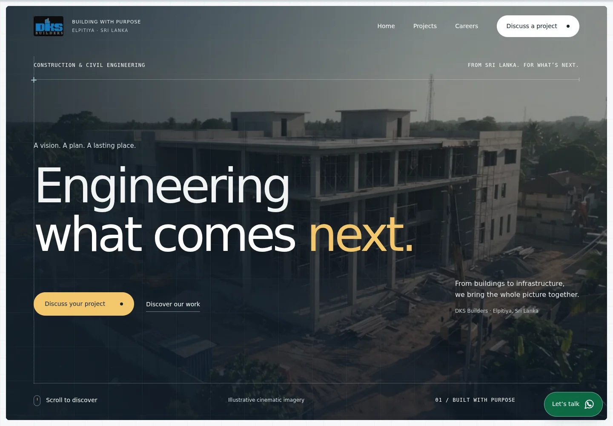
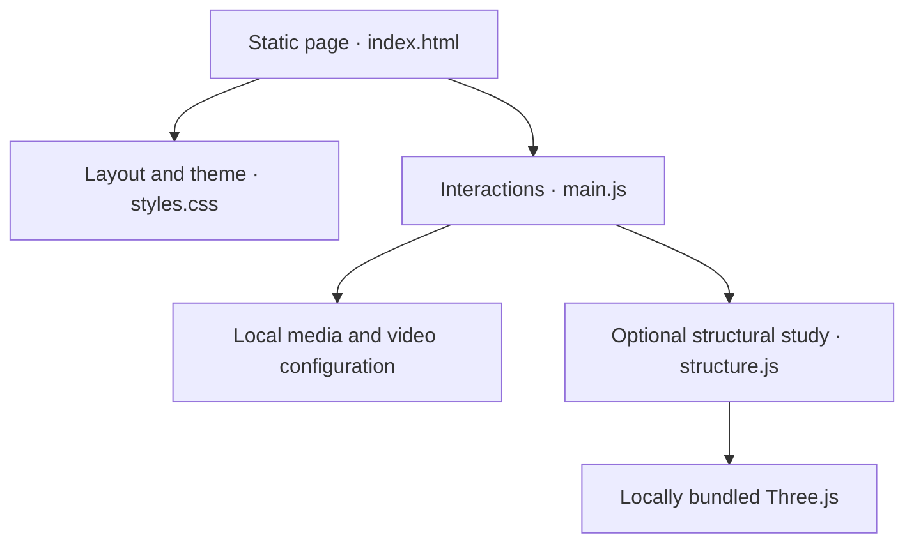

# DKS Builders

| Project credit | Contributor |
| :--- | :--- |
| Client project & development company | **[Quentagon](https://quentagon.com/)** |
| Initial foundation & technical setup | **[Rizad Mohamed](https://www.linkedin.com/in/rizad-mohamed/)** |
| Contributions | **[Hirusha Nilupul](https://www.linkedin.com/in/hirushanilupul/)** |

A responsive engineering portfolio and landing page for DKS Builders, Sri Lanka.

[](https://github.com/rizad-mohamed/dksbuilders/actions/workflows/ci.yml)

**[Live demo](https://dks-builders-reimagined.hirushailupul.chatgpt.site)** · **[Deployment guide](docs/deployment.md)**

The current live demo is access controlled through Sites; access may require an authorized account.



## Features

- Engineering drawing aesthetic, responsive layouts and cinematic hero video with mobile crop, poster fallback and playback controls.
- Supplied project photography, eight trusted-brand logos, six construction disciplines and accessible project/service disclosures.
- Workflow micro animations, horizontal scroll progress and an optional interactive Three.js structural study.
- Google Maps office embed, directions link, floating WhatsApp shortcut and Quentagon footer credit.
- Reduced-motion and data-saving support, with video paused off screen or when the tab is hidden.

## Tech Stack

[](https://skillicons.dev)

**Frontend:** semantic HTML5, CSS3, JavaScript and Three.js. **Tooling:** Node.js/npm, esbuild and Python. **Quality:** Playwright and axe-core. **Delivery:** GitHub Actions and Sites static hosting.

## Getting Started

Requires **Node.js 22+**, **npm 10+** and **Python 3.12+**. CI uses Node.js 24 and Python 3.12.

```sh
git clone https://github.com/rizad-mohamed/dksbuilders.git
cd dksbuilders
npm ci --ignore-scripts
npm run dev
```

Open **http://localhost:3000**. Edit the source files directly in `dist/`; there is no framework server or separate `src/` directory.

## Environment Variables

**None required.** Local development, static hosting and the existing CI workflow require no runtime API keys or application secrets. An `.env.example` is unnecessary until a configurable integration is added. Never commit credentials.

## Available Scripts

| Command | Purpose |
| :--- | :--- |
| `npm run dev` | Serve the site locally on port 3000. |
| `npm run check` | Audit syntax, assets, navigation, metadata and security policies. |
| `npm run lint` / `npm test` | Aliases for the same static checks. |
| `npm run build` | Bundle the local Three.js module and validate production files. |
| `npm run test:browser` | Check responsive layouts, accessibility and core interactions. |
| `npm run test:video` | Verify MP4 playback, controls and fallbacks. |
| `npm run test:design` | Verify portfolio assets, motion, map, WhatsApp and credits. |
| `npm run package:release` | Produce a deployment archive, checksum and source commit reference. |

Before running browser checks, install Chromium with `npx playwright install --with-deps chromium`. Use `npm audit` to review dependency advisories. There is no `npm start` script; production is served as static files.

## Project Structure

| Path | What to change |
| :--- | :--- |
| `dist/index.html` | Page content, navigation, contact details and SEO metadata. |
| `dist/styles.css` | Layout, typography, engineering theme and responsive styles. |
| `dist/main.js` | Navigation, disclosures, progress, motion and media behavior. |
| `dist/structure.js` | Optional 3D structural study. |
| `dist/media-config.json` / `dist/assets/` | Hero video configuration, images and media. |
| `scripts/` | Development server, build, validation and release tooling. |
| `.github/` | CI/release workflow and Dependabot configuration. |
| `.openai/hosting.json` | Existing Site identity and static output configuration. |
| `docs/` | Deployment, QA, SEO and asset provenance notes. |

Keep supplied project imagery and brand marks traceable; illustrative imagery must remain clearly labelled. See [content and asset notes](docs/content-and-assets.md).

## Deployment

Run `npm run build`, then serve **`dist/` at the web origin root**. Absolute `/assets/…` paths require changes before hosting under a subpath such as GitHub Pages. Apply `dist/_headers` or equivalent host policies; video hosting must support correct MIME types and byte-range requests.

The current demo uses **Sites**. A GitHub push runs CI and produces a tested deployment archive; it does **not** automatically publish to the live Site. Version tags matching `v*` also create a GitHub Release after validation. Publishing and domain changes are covered in the [deployment guide](docs/deployment.md).

## Project Architecture



## Responsive & Browser Support

Mobile, tablet and desktop layouts are checked at **320, 390, 768, 1280, 1440 and 2560 px**. Automated coverage uses Chromium. Firefox, Safari and Edge are intended modern-browser targets; confirm them manually before a client rollout.

## Performance / SEO

- Responsive WebP imagery, lazy loading below the fold, local assets and an optional 3D enhancement with a static fallback.
- Page metadata, canonical URL, Open Graph tags, LocalBusiness structured data, sitemap and `robots.txt`.
- Update canonical, social, structured-data, sitemap and robots URLs together when changing domains.

See [SEO notes](docs/research-and-local-seo.md) and [QA results](docs/qa.md). Automated checks are not a full accessibility certification or a measured Lighthouse score.

## Code Quality

Locked dependencies, syntax/static audits, Playwright/axe checks and dependency auditing run in GitHub Actions for pull requests, `main` pushes, version tags and manual runs. CI retains QA diagnostics and checksum-verified delivery archives. Dependabot checks npm and Actions updates monthly.

## Contributing

Use descriptive branches such as `feat/project-gallery`, `fix/mobile-menu` or `docs/readme`. Follow the existing HTML/CSS/JavaScript conventions, make focused commits and open a pull request against `main` with a clear description and validation notes.

Run `npm run check` and `npm run build` before requesting review. For interface or media changes, also run the relevant browser checks and include desktop/mobile screenshots. Keep CI passing and preserve client asset attribution.

## License

Proprietary client project developed by **[Quentagon](https://quentagon.com/)** for **DKS Builders**. No open-source license is granted by this repository. Client assets and third-party trademarks retain their respective owners’ rights; bundled third-party software retains its own license notices.
